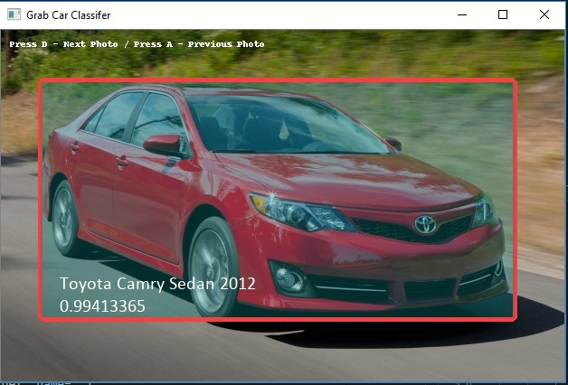
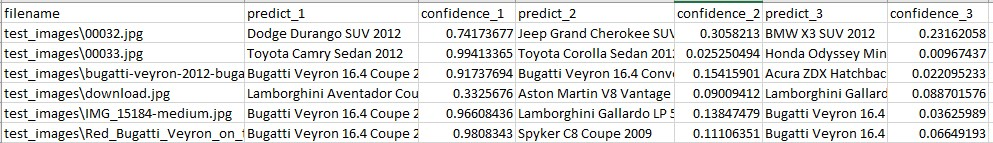
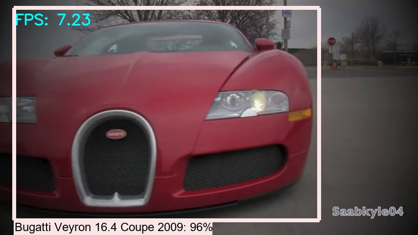

# Grab Car Classifier
Grab car classifier project is inspired from the Grab "AI FOR S.E.A." competition
 
Name: Lim Ji Chen
 
Email: jasonakon@gmail.com
 
#### *Note: Please read the README.pdf for more detailed documentation and explanation.
## Introduction:
This project inspired by Grab “AiForSea”, Computer Vision challenge to classify and recognise distinct car images based on a given dataset. Here, car make and models can be classified immediate with any input images that belong to the provided car class dataset family which are 196 in total. This project uses a lightweight model that allowed to produce faster result and accurate result at the same time. 
 
Thank you for giving such opportunity and let’s get ready to classify!
 
## Dependencies:
You’ll need have the following installed:
 
•	Python3
 
•	Opencv
 
•	Tensorflow v1.13 (latest-recommended)
 
•	Pillow
 
•	Numpy
 
•	CSV
 
•	Windows/Ubuntu
 
## Trained Model:
Model can be found at: “car_classifier/trained_model/grab_model/”
 
#### Full complete model with checkpoint can be downloaded at : https://drive.google.com/open?id=1XpZlvwdRf9vINymxMu4dW4_B8YkZQrVk
 
## How to?
Head into working directory: “car_classifier/”:
 
Then, this project provides 3 different methods of classification based on your input preferences:
 
### Method 1: Classify and view (images):
This method allows you to view the output generated from the model through a simple GUI:
 
1.  Insert your test dataset (images) into the folder “test_images”
2.  Run “classify_image.py” using python
4.  To navigate your test photos using (keyboard):
5.  Press D – Next Photos
6.  Press A – Previous Photos
7.  Observe the class prediction and its confidence level in GUI and command log.

*Note: sometimes you need to hold it or press multiple times to navigate

### Method 2: Classify into CSV (images): (Recommended)
This method allows you to generate all the prediction output based on your test image dataset into .csv format which include the image file name and 3 top class predictions and its confidence level % as well. 
 
1.  Insert your test dataset (images) into the folder “test_images”
2.  Run “classify_image_into_csv.py” using python
3.  Observe the command log and wait for it to generate all outputs
4.  Once successful, proceed to view the “car_classify_output.csv”

### Method 3: Car detection (videos):
This method enables its utility feature to predict output in real-time video playback:
 
1.	Insert your test dataset (videos) into the folder “test_videos”
2.	Run “classify_video.py” using python with the command:
4.	Python classify_video.py --input <video’s file name>
5.	Example: “python classify_video.py --input video_1.mp4”
6.	*Note: not full path, just the video file’s name.
7.	Sit back and observe the output as below:

### Conclusion: 
Thank you for taking your time in evaluating my trained model with the methods as above. I would like to confess that my model might not be very high in accuracy since I have limited resources in training process. However, I will be improving the model from current time being and please let me know if you have any doubts or questions regarding to my implementation and model.

